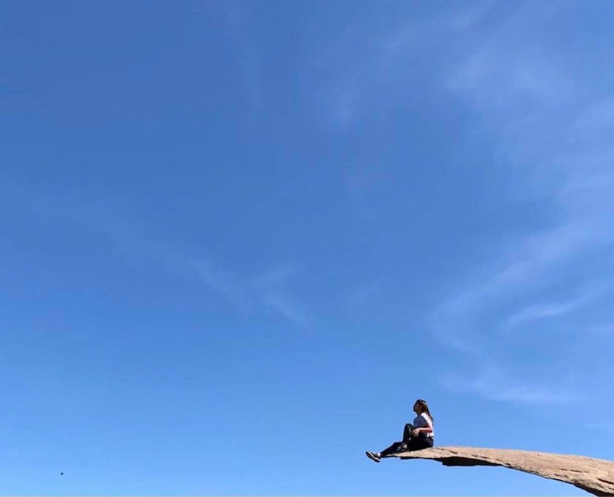
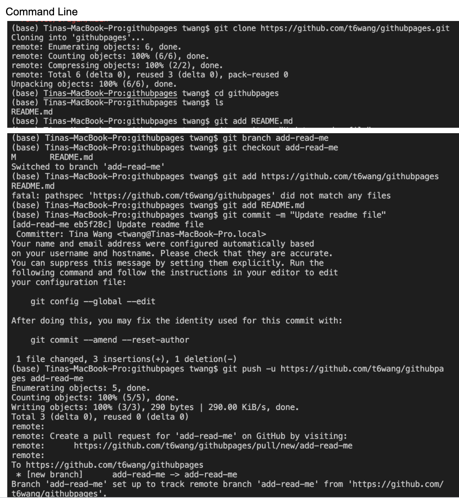
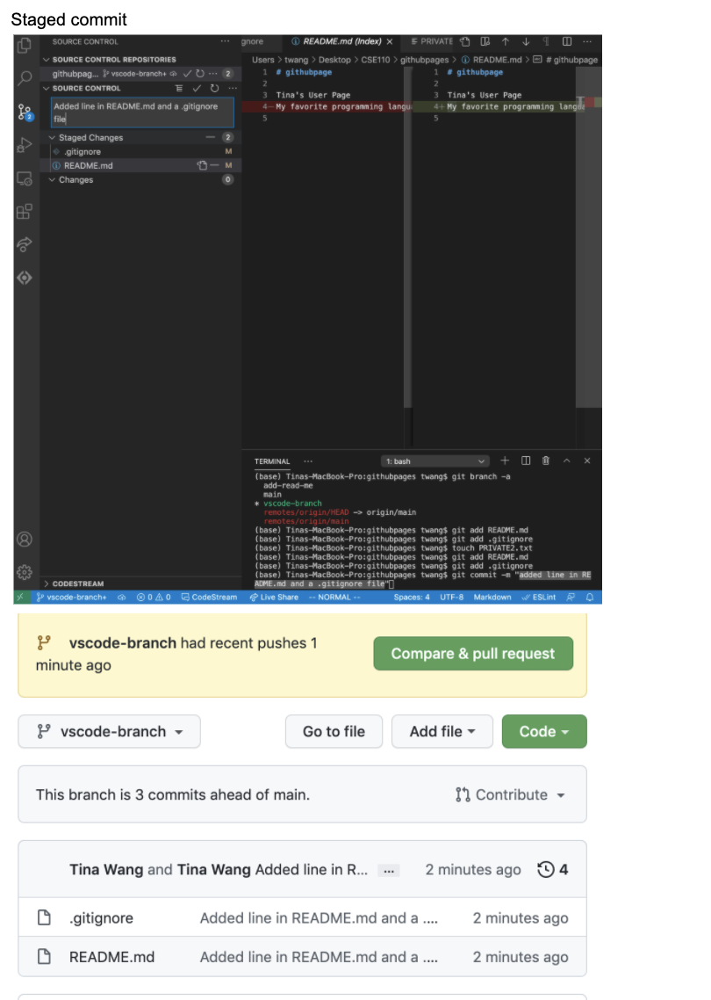

<a name="my_name"></a>

# Tina's Github Page

**Hi! My name is Tina and this is my first lab project in my software development class (CSE 110). The purpose of this lab is to give an introduction to who I am as a programmer and a person.**

## Basic Info
- **College: Revelle**
- **Major: Math-CS**
- **Year: 4th**

## My Favorite Quote
> The best way out is through

## My Favorite Git Command
```
git commit -m 

```
You can find screenshots of my command line git transactions and staged commit from this lab [here](#screenshots)

## My Favorite Programming Languages
1. C++
2. Python
3. Java

## Outside of school, I like to...
- Explore new music
- Hike! Below is a picture of my most recent hike at  in San Diego! 
You can find a list of hikes in San Diego I have/have not checked off [here](#hikes)!
  
<a name="screenshots"></a> 

## Screenshots on this Lab
- 
- 

<a name="hikes"></a> 
## List of Hikes in San Diego
- [x] Potato Chip Rock
- [x] Torrey Pines State Park
- [x] Ho Chi Minh Trail
- [ ] Los Penasquitos Canyon Trail
- [x] Three Sisters Falls Trails
- [ ] Iron Mountain

## Back to [top](#my_name)


